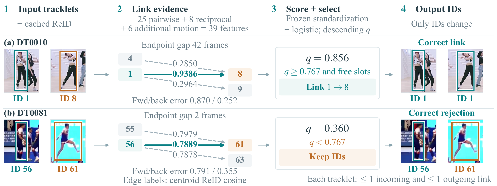
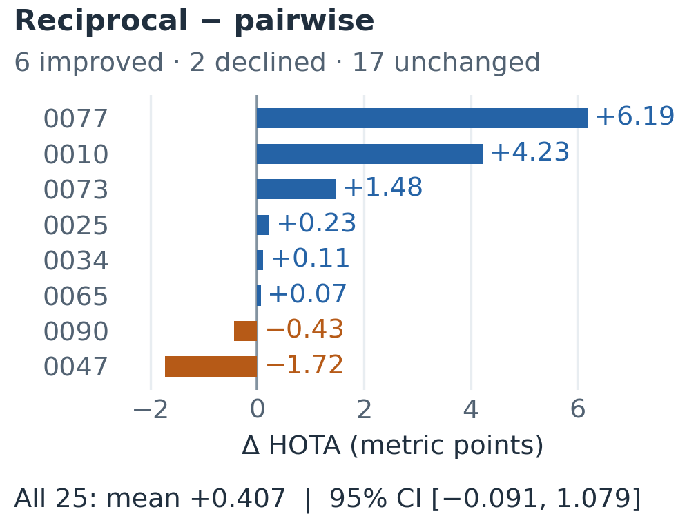

# TrackRelink

**Learned Offline Tracklet Repair with Fixed Detections**

TrackRelink links fragmented trajectories after a host tracker has finished. A frozen logistic model combines geometry, cached appearance, reciprocal competition and bidirectional motion. Greedy constrained selection changes identity labels while preserving the original detections, frames, boxes and confidence values.

This repository accompanies the research manuscript of the same title. It provides the frozen inference implementation, model, real Figure 1 examples, final figures and numerical summaries. It is a research release, not a claim of accepted publication or a complete detector/ReID training pipeline.



The images are real DanceTrack observations. Colors identify the input/output track IDs; edge labels are centroid cosine similarities, while **q** is the learned repair score. The frozen threshold is **0.766583780987215**. Both the threshold and available predecessor/successor slots must permit a link. Dataset-image rights are separate from this project's code; see [third-party notices](THIRD_PARTY_NOTICES.md).

## Quick start

Python 3.10 or later is required. From the repository root:

```bash
python -m venv .venv
# Linux/macOS: source .venv/bin/activate
# Windows PowerShell: .venv\Scripts\Activate.ps1
python -m pip install -e .
python examples/replay_figure1.py
python -m unittest discover -s tests -v
```

The replay needs no dataset download, GPU, detector, ReID model or ground-truth file. It uses archived feature vectors and host outputs for both complete example videos, recomputes the frozen scores and constrained decisions, then verifies the saved ID-only outputs. It demonstrates **frozen scoring, selection and relabeling**; it does not rerun visual feature extraction.

Expected highlighted decisions:

| Sequence | Candidate | Repair score | Decision |
|---|---|---:|---|
| DanceTrack0010 | 1 → 8 | 0.856207 | Link; the output uses ID 1 |
| DanceTrack0081 | 56 → 61 | 0.360407 | Reject; retain distinct IDs |

The second video can contain other accepted links. Rejecting the illustrated pair does not imply rejecting every candidate in the video.

## Apply to your own host output

Provide one sequence in MOT CSV format and an NPZ archive of cached, time-ordered descriptors keyed by host track ID:

```bash
trackrelink --tracks host.txt --embeddings embeddings.npz --model models/trackrelink_frozen.npz --output outputs/repaired.txt
```

Each MOT row starts with `frame,id,x,y,width,height`; remaining fields are retained. An embedding archive can be constructed with `numpy.savez("embeddings.npz", **{"1": descriptors_for_track_1, "8": descriptors_for_track_8})`, where each matrix has shape `observations × descriptor_dimension`. Use descriptors from the host's matched detections, in temporal order, with the same descriptor dimension across tracks. See [the input contract](docs/REPRODUCIBILITY.md) for the exact scope and restrictions. The bundled model was fitted for the recorded protocol; changing the host or descriptor model changes its input distribution.

## Results and interpretation

On the same 25 explored DanceTrack validation videos:

| Host | Pooled HOTA gain, full method − host | Macro gain [descriptive 95% interval] |
|---|---:|---:|
| Deep OC-SORT | +1.225 | +1.064 [0.454, 1.783] |
| StrongSORT-derived | +0.617 | +0.580 [0.096, 1.172] |

Values are metric-point changes, not percentages. Pooled metrics and video-macro differences are different estimands. See [frozen metrics](results/frozen_metrics.json) for the per-video values and [research scope](docs/REPRODUCIBILITY.md) for interpretation.

Pairwise repair also improves both hosts. General superiority of the added reciprocal features is **not established**. Whole-trajectory reliability remains unresolved: the original 30 selected links include 18 unresolved under the training-label rule; the second host has conflicting as well as unresolved actions. A training-only boundary gate selected no actions. Shared upstream inputs, explored videos and upstream training overlap limit generalization. Separate calibration diagnostics do not drive repair, and **q is not asserted to be a calibrated probability**.



This second figure shows the eight videos with nonzero changes; the other 17 videos remain in the 25-video macro estimate and interval. It is a mechanism comparison, not the headline full-method-versus-host gain.

## Repository contents

- `src/trackrelink/`: feature construction, frozen inference, greedy selection and training utilities.
- `models/trackrelink_frozen.npz`: original frozen 39-feature model, copied without refitting.
- `examples/`: complete saved scoring and relabeling replay for the two Figure 1 videos.
- `figures/`: final overview and comparison figures in PNG and PDF.
- `results/`: frozen pooled and per-video numerical summaries.
- `configs/`: recorded dataset split.
- `tests/`: core algorithm and public-interface checks.
- `docs/`: input contract, provenance and release verification.

The public namespace is `trackrelink`. Source provenance records the mechanical namespace changes from the internal research implementation. Model parameters, feature order, candidate gates and selection rules are unchanged.

## License and attribution

**No open-source license has been selected for this release.** The code is published for viewing; this repository does not grant a general reuse license. Third-party data and image rights remain with their respective owners and are not relicensed here. See [THIRD_PARTY_NOTICES.md](THIRD_PARTY_NOTICES.md).

Dataset and host references: [DanceTrack](https://github.com/DanceTrack/DanceTrack), [Deep OC-SORT](https://github.com/GerardMaggiolino/Deep-OC-SORT), [StrongSORT](https://github.com/dyhBUPT/StrongSORT), and [TrackEval](https://github.com/JonathonLuiten/TrackEval). Their code, datasets, detector weights and ReID weights are not vendored in this release. Publication metadata will be added when finalized.
